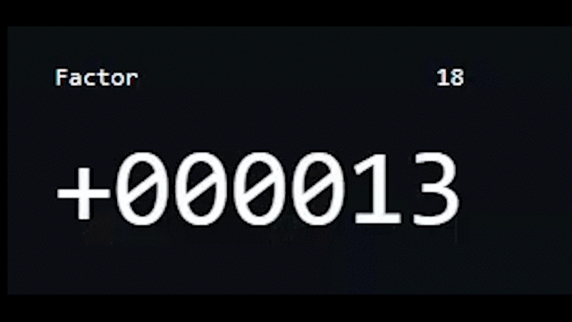

# Number-Scroll-Animation

5 Functions: 
<ul>
  <li>createNumberArray(number) - Function to create an array. The digits are always rounded to 6</li>
  <li>animateNumber(number, element) - Function for generating the number and displaying as well as animating the individual number place </li>
  <li>createNumberHTML(numbers, old, element) - Function to pass generated number as HTML element </li>
  <li>calcDeltaBetweenNumbers(oldNumber, newNumber) - Function to get the delta between each number. This function creates an array of spans </li>
  <li>randomNumber(min, max) - Function to generate a random value </li>
</ul>

